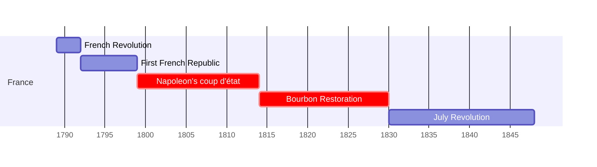
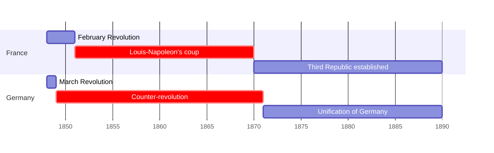

## نشست دوم: بین الملل انتقادی 
### قسمت اول

---
layout: center
dir: rtl
---

## سه  جزء نقد هنری

<v-clicks>

- تشریح
- تفسیر
- حکم

</v-clicks>

---
layout: image-caption
image: https://upload.wikimedia.org/wikipedia/commons/thumb/b/b9/Caspar_David_Friedrich_-_Wanderer_above_the_sea_of_fog.jpg/800px-Caspar_David_Friedrich_-_Wanderer_above_the_sea_of_fog.jpg
caption: کاسپر داوید فردریش، «سرگردان بر فراز دریای مه»، 1818
---

---
layout: full
dir: rtl

---

##   انقلاب ها و ضدانقلاب ها در فرانسه و آلمان (1789-1890)
### از انقلاب فرانسه تا 1848 

### از 1848

---
layout: image-caption
image: https://upload.wikimedia.org/wikipedia/commons/thumb/f/fb/David_Brutus.jpg/1200px-David_Brutus.jpg
caption: ژاک-لویی داوید، «لیکتورها یدن فرزند بروتوس را می آورند»، 1789
---
## Neoclacicism

---
layout: image-caption
image: https://upload.wikimedia.org/wikipedia/commons/thumb/1/1e/Jacques-Louis_David_-_The_Coronation_of_Napoleon_%281805-1807%29.jpg/1280px-Jacques-Louis_David_-_The_Coronation_of_Napoleon_%281805-1807%29.jpg
caption:  ژاک-لویی داوید، «تاج گذاری ناپلئون»، 1807-1805  
---

---
layout: image-caption
image: https://smarthistory.org/wp-content/uploads/2020/08/martin.jpg
caption: ژان باپتیست مارتین، «نشست آکادمی سلطنتی نقاشی و مجسمه سازی در لوور»، 1712-21
---
## آکادمی

<!-- 
The Académie Royale de Peinture et de Sculpture (Royal Academy of Painting and Sculpture) was established in 1648. It oversaw—and held a monopoly over—the arts in France until 1793.
 -->

---
layout: image-caption
image: https://smarthistory.org/wp-content/uploads/2020/09/L%E2%80%99e%CC%81tude-du-dessin-Charles-Nicolas-Cochin-le-Jeune--scaled.jpg
caption: بنوآ لوئی پروست، «مدرسه هنر»، 1763
---

---
layout: image-caption
image: https://images.squarespace-cdn.com/content/v1/54a35239e4b0f4be674283ef/1444313765494-A6BQW6KPR3V6NXB7ZXDA/image-asset.jpeg
caption: 
---

## *feuilleton* پاورقی

<!-- note: 
The feuilleton has been described as a "talk of the town"
"Interestingly, though, since writings that dealt primarily with cultural topics
enjoyed less stric standards of cencorship, art criticism often became the site of 
vieled political commentaries." KH 33 -->

---
layout: image-caption
image: https://upload.wikimedia.org/wikipedia/commons/thumb/3/3d/Stendhal.jpg/799px-Stendhal.jpg
caption: استاندال، «اولوف یوهان سودرمارک»، 1840
---

## Marie-Henri Beyle (Stendhal)
### 1783-1842

---
layout: image-caption
image: https://upload.wikimedia.org/wikipedia/commons/thumb/7/70/Eug%C3%A8ne_Delacroix_-_The_Barque_of_Dante.jpg/1200px-Eug%C3%A8ne_Delacroix_-_The_Barque_of_Dante.jpg
caption: اوژن دلاکروا، «قایق دانته»، 1822
---

<!-- 
note: included in 1822 salon, resulted in a controversy
- a subject drawn from a canonical literary work
- artist was unsure 
- Theophile Gautier appreciated the work
-->

---
layout: image-caption
src: https://www.everypainterpaintshimself.com/blog_images/Ingres_vs_Delacroix.jpg
caption: دوئل میان انگر و دلاکروا
---

---
layout: image-caption
image: https://upload.wikimedia.org/wikipedia/commons/thumb/0/02/La_Libert%C3%A9_guidant_le_peuple_-_Eug%C3%A8ne_Delacroix_-_Mus%C3%A9e_du_Louvre_Peintures_RF_129_-_apr%C3%A8s_restauration_2024.jpg/1280px-La_Libert%C3%A9_guidant_le_peuple_-_Eug%C3%A8ne_Delacroix_-_Mus%C3%A9e_du_Louvre_Peintures_RF_129_-_apr%C3%A8s_restauration_2024.jpg
caption: اوژن دولاکروا، « آزادی هدایتگر مردم»،  1830
---

<!-- The French government bought the painting in 1831 for 3,000 francs with the intention of displaying it in the throne room of the Palais du Luxembourg as a reminder to the "citizen-king" Louis-Philippe of the July Revolution, through which he had come to power. -->

---
layout: compare
image1:
    src: https://upload.wikimedia.org/wikipedia/commons/thumb/4/43/Sans-culotte.jpg/745px-Sans-culotte.jpg
    alt: لویی-لئوپولد بویلی، sans-culotte
image2:
    src: https://upload.wikimedia.org/wikipedia/commons/thumb/2/23/Louis_le_dernier3_crop.jpg/751px-Louis_le_dernier3_crop.jpg
    alt: لوئی شانزدهم
---

---
layout: center
dir: rtl
---

## انگلیس

---
layout: image-caption
image: https://upload.wikimedia.org/wikipedia/commons/thumb/e/ed/View_over_Leeds%2C_smoking_chimneys_Wellcome_L0049034.jpg/1024px-View_over_Leeds%2C_smoking_chimneys_Wellcome_L0049034.jpg
caption: آلودگی هوا در اوایل قرن بیستم نمایی از لیدز
---

---
layout: compare
dir: rtl
image1:
    src: https://upload.wikimedia.org/wikipedia/commons/thumb/e/ed/View_over_Leeds%2C_smoking_chimneys_Wellcome_L0049034.jpg/1024px-View_over_Leeds%2C_smoking_chimneys_Wellcome_L0049034.jpg
    alt: لیدز اوایل قرن بیستم
image2:
    src: https://monovisions.com/wp-content/uploads/2015/06/historic-bw-photos-of-venice-italy-in-19th-century-06.jpg
    alt: ونیز قرن نوزدهم
---

---
layout: image-caption
image: https://collectionapi.metmuseum.org/api/collection/v1/iiif/342383/755324/main-image
caption: جان راسکین، «ایوان کاخ دوکال»، 1850
---

---
layout: image-caption
image: https://i0.wp.com/blog.artsper.com/wp-content/uploads/2022/03/1_1k6ZqrYsI-23bwHJqqBQ0Q.jpeg?w=1400&ssl=1
caption: اتاق طاووس، طراحی شده توسط توماس جکیل و جیمز مک نیل ویستلر در سال 1877 
---
## جنبش هنر و پیشه

---
layout: image-caption
image: https://i0.wp.com/blog.artsper.com/wp-content/uploads/2022/03/standen-house-national-trust.jpg?w=1200&ssl=1
caption: خانه استندن که توسط فیلیپ وب طراحی شد و بین سال های 1891 و 1894 ساخته شد
---

---
layout: image-caption
image: https://media.tate.org.uk/aztate-prd-ew-dg-wgtail-st1-ctr-data/images/.width-840_413N76J.jpg
caption: جان اورت میلی، « اوفلیا »، 1852
dir
---

## انجمن برادری پیشارافائلی

---
layout: image-caption
image: https://upload.wikimedia.org/wikipedia/commons/thumb/2/26/Slave-ship.jpg/1280px-Slave-ship.jpg
caption: ترنر، «کشتی بردگان»، 1840

---

<!-- exhibited at The Royal Academy of Arts in 1840 -->

---
layout: quote
dir: rtl
---

## The Whole and parts relation
این تنها تصویر کاملی است که هم تمامیت و تأثیر کلی طبیعت و هم کمال پایان ناپذیر جزئیات طبیعت را دارد. و تنها در تلاش برای متحد کردن اینها است که یک نقاش واقعاً پیشرفت می کند. تنها با هدف قرار دادن جزئیات، او تبدیل به یک مکانیک می شود. تنها با هدف قرار دادن ژنرال ها، او به یک شیاد تبدیل می شود: سقوط او در هر دو مورد مطمئن است. بنابراین، هنرمند همیشه باید دو سؤال از خود بپرسد، اول "آیا تمام حق من است؟" ثانیاً، "آیا می توان جزئیات من را به آن اضافه کرد؟ آیا فضایی در تصویر وجود دارد که بتوانم فکر دیگری را در آن جمع کنم؟ آیا منحنی در آن وجود دارد که بتوانم آن را تعدیل کنم - خطی که بتوانم فارغ التحصیل شوم - یک جای خالی که بتوانم پر کنم؟ آیا نقطه ای وجود دارد که با هر نگاهی یا کنجکاوی، آن را بفهمد یا از بین ببرد، اگر چنین است، تصویر من ناقص است و اگر در تعدیل خط یا پر کردن جای خالی، به اثر کلی لطمه بزنم، هنر من ناقص است؟ 
\- راسکین, p.249
<!-- > That only is a complete picture which has both the general wholeness and effect of nature, and the inexhaustible perfection of nature's details. And it is only in the effort to unite these that a painter really improves. By aiming only at details, he becomes a mechanic; by aiming only at generals, he becomes a trickster: his fall in both cases is sure . Two questions the artist has, therefore, always to ask himself,-first "Is my whole right?" Secondly, "Can my details be added to? Is there a single space in the picture where I can crowd in another thought? Is there a curve in it which I can modulate-a line which I can graduate-a vacancy I can fill? Is there a single spot which the eye, by any peering or prying, can fathom or exhaust? If so, my picture is imperfect; and if, in modulating the line or filling the vacancy, I hurt the general effect, my art is imperfect."  -->

---
layout: quote
dir: rtl
---
## نقد ذوق عمومی
بنابراین، مطبوعات و همه کسانی که وانمود می‌کنند که سلایق عمومی را رهبری می‌کنند، آنقدر نمی‌توانند به انبوهی که به سراغ چه کسی مراجعه کنند، هدایت کنند، بلکه باید چه چیزی را بخواهند. کار آنها این نیست که به ما بگویند بهترین نقاش ما کدام است، بلکه این است که به ما بگویند آیا ما بهترین نقاشمان را به بهترین شکل ممکن انجام می دهیم یا خیر.

\-راسکین, p. 248

<!-- 
> The press, therefore, and all who pretend to lead the public taste, have not so much to direct the multitude who to go to, as what to ask for. Their business is not to tell us which is our best painter, but to tell us whether we are making our best painter do his best. -->