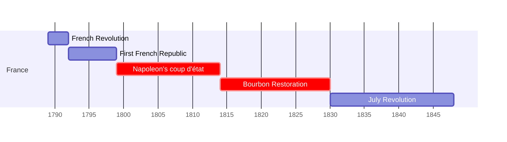
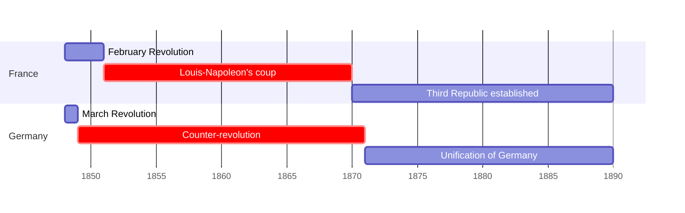

# نشست دوم: بین الملل انتقادی {#session2}
### قسمت اول

---
layout: center
dir: rtl
---

## سه  جزء نقد هنری

<v-clicks>

- تشریح
- تفسیر
- حکم

</v-clicks>

---
layout: image-caption
image: https://upload.wikimedia.org/wikipedia/commons/thumb/b/b9/Caspar_David_Friedrich_-_Wanderer_above_the_sea_of_fog.jpg/800px-Caspar_David_Friedrich_-_Wanderer_above_the_sea_of_fog.jpg
caption: کاسپر داوید فردریش، «سرگردان بر فراز دریای مه»، 1818
---

---
layout: full
dir: rtl

---

##   انقلاب ها و ضدانقلاب ها در فرانسه و آلمان (1789-1890)
### از انقلاب فرانسه تا 1848 

### از 1848

---
layout: image-caption
image: https://upload.wikimedia.org/wikipedia/commons/thumb/f/fb/David_Brutus.jpg/1200px-David_Brutus.jpg
caption: ژاک-لویی داوید، «لیکتورها یدن فرزند بروتوس را می آورند»، 1789
---
## Neoclacicism

---
layout: image-caption
image: https://upload.wikimedia.org/wikipedia/commons/thumb/1/1e/Jacques-Louis_David_-_The_Coronation_of_Napoleon_%281805-1807%29.jpg/1280px-Jacques-Louis_David_-_The_Coronation_of_Napoleon_%281805-1807%29.jpg
caption:  ژاک-لویی داوید، «تاج گذاری ناپلئون»، 1807-1805  
---

---
layout: image-caption
image: https://smarthistory.org/wp-content/uploads/2020/08/martin.jpg
caption: ژان باپتیست مارتین، «نشست آکادمی سلطنتی نقاشی و مجسمه سازی در لوور»، 1712-21
---
## آکادمی

<!-- 
The Académie Royale de Peinture et de Sculpture (Royal Academy of Painting and Sculpture) was established in 1648. It oversaw—and held a monopoly over—the arts in France until 1793.
 -->

---
layout: image-caption
image: https://smarthistory.org/wp-content/uploads/2020/09/L%E2%80%99e%CC%81tude-du-dessin-Charles-Nicolas-Cochin-le-Jeune--scaled.jpg
caption: بنوآ لوئی پروست، «مدرسه هنر»، 1763
---

---
layout: image-caption
image: https://images.squarespace-cdn.com/content/v1/54a35239e4b0f4be674283ef/1444313765494-A6BQW6KPR3V6NXB7ZXDA/image-asset.jpeg
caption: 
---

## *feuilleton* پاورقی

<!-- note: 
The feuilleton has been described as a "talk of the town"
"Interestingly, though, since writings that dealt primarily with cultural topics
enjoyed less stric standards of cencorship, art criticism often became the site of 
vieled political commentaries." KH 33 -->

---
layout: image-caption
image: https://upload.wikimedia.org/wikipedia/commons/thumb/3/3d/Stendhal.jpg/799px-Stendhal.jpg
caption: استاندال، «اولوف یوهان سودرمارک»، 1840
---

## Marie-Henri Beyle (Stendhal)
### 1783-1842

---
layout: image-caption
image: https://upload.wikimedia.org/wikipedia/commons/thumb/7/70/Eug%C3%A8ne_Delacroix_-_The_Barque_of_Dante.jpg/1200px-Eug%C3%A8ne_Delacroix_-_The_Barque_of_Dante.jpg
caption: اوژن دلاکروا، «قایق دانته»، 1822
---

<!-- 
note: included in 1822 salon, resulted in a controversy
- a subject drawn from a canonical literary work
- artist was unsure 
- Theophile Gautier appreciated the work
-->

---
layout: image-caption
src: https://www.everypainterpaintshimself.com/blog_images/Ingres_vs_Delacroix.jpg
caption: دوئل میان انگر و دلاکروا
---

---
layout: image-caption
image: https://upload.wikimedia.org/wikipedia/commons/thumb/0/02/La_Libert%C3%A9_guidant_le_peuple_-_Eug%C3%A8ne_Delacroix_-_Mus%C3%A9e_du_Louvre_Peintures_RF_129_-_apr%C3%A8s_restauration_2024.jpg/1280px-La_Libert%C3%A9_guidant_le_peuple_-_Eug%C3%A8ne_Delacroix_-_Mus%C3%A9e_du_Louvre_Peintures_RF_129_-_apr%C3%A8s_restauration_2024.jpg
caption: اوژن دولاکروا، « آزادی هدایتگر مردم»،  1830
---

<!-- The French government bought the painting in 1831 for 3,000 francs with the intention of displaying it in the throne room of the Palais du Luxembourg as a reminder to the "citizen-king" Louis-Philippe of the July Revolution, through which he had come to power. -->

---
layout: compare
image1:
    src: https://upload.wikimedia.org/wikipedia/commons/thumb/4/43/Sans-culotte.jpg/745px-Sans-culotte.jpg
    alt: لویی-لئوپولد بویلی، sans-culotte
image2:
    src: https://upload.wikimedia.org/wikipedia/commons/thumb/2/23/Louis_le_dernier3_crop.jpg/751px-Louis_le_dernier3_crop.jpg
    alt: لوئی شانزدهم
---

