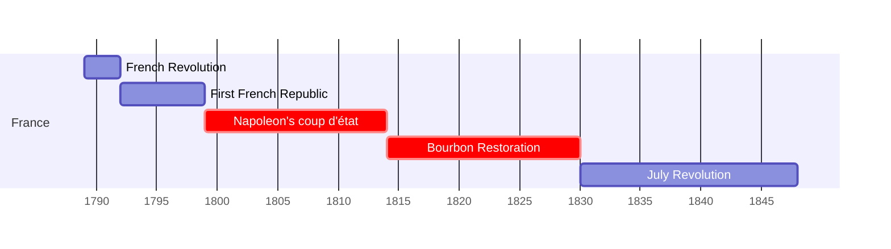
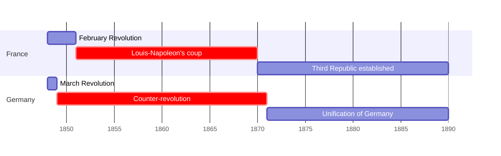

## نشست دوم: بین الملل انتقادی 
### قسمت اول

---
layout: center
dir: rtl
---

## سه  جزء نقد هنری

<v-clicks>

- تشریح
- تفسیر
- حکم

</v-clicks>

---
layout: full
dir: rtl

---

##   انقلاب ها و ضدانقلاب ها در فرانسه و آلمان (1789-1890)
### از انقلاب فرانسه تا 1848 

### از 1848

---
layout: image-caption
image: https://images.squarespace-cdn.com/content/v1/54a35239e4b0f4be674283ef/1444313765494-A6BQW6KPR3V6NXB7ZXDA/image-asset.jpeg
caption: The feuilleton has been described as a "talk of the town"
---

## *feuilleton* or legitimate news 

<!-- note:  "Interestingly, though, since writings that dealt primarily with cultural topics
enjoyed less stric standards of cencorship, art criticism often became the site of 
vieled political commentaries." KH 33 -->

---
layout: image-caption
image: https://upload.wikimedia.org/wikipedia/commons/thumb/f/fb/David_Brutus.jpg/1200px-David_Brutus.jpg
caption: Jacques-Louis David, *The Lictors Bring to Brutus the Bodies of His Sons*, 1789, oil on canvas, 323 cm × 422 cm (127 in × 166 in)
---
## Neoclacicism

---
layout: image-caption
image: https://upload.wikimedia.org/wikipedia/commons/thumb/3/3d/Stendhal.jpg/799px-Stendhal.jpg
caption: Stendhal, by Olof Johan Södermark, 1840
---

## Marie-Henri Beyle (Stendhal)
### 1783-1842

---
layout: image-caption
image: https://upload.wikimedia.org/wikipedia/commons/thumb/7/70/Eug%C3%A8ne_Delacroix_-_The_Barque_of_Dante.jpg/1200px-Eug%C3%A8ne_Delacroix_-_The_Barque_of_Dante.jpg
caption: Eugène Delacroix, *The Barque of Dante*, 1822, Oil on canvas, 189 cm × 246 cm (74 in × 95 in)
---

<!-- 
note: included in 1822 salon, resulted in a controversy
- a subject drawn from a canonical literary work
- artist was unsure 
- Theophile Gautier appreciated the work
-->

---
layout: image-caption
image: https://upload.wikimedia.org/wikipedia/commons/thumb/0/02/La_Libert%C3%A9_guidant_le_peuple_-_Eug%C3%A8ne_Delacroix_-_Mus%C3%A9e_du_Louvre_Peintures_RF_129_-_apr%C3%A8s_restauration_2024.jpg/1280px-La_Libert%C3%A9_guidant_le_peuple_-_Eug%C3%A8ne_Delacroix_-_Mus%C3%A9e_du_Louvre_Peintures_RF_129_-_apr%C3%A8s_restauration_2024.jpg
caption: La Liberté guidant le peuple - Eugène Delacroix - Musée du Louvre Peintures RF 129 - après restauration 2024
---

---
layout: compare
image1:
    src: https://upload.wikimedia.org/wikipedia/commons/thumb/4/43/Sans-culotte.jpg/745px-Sans-culotte.jpg
    alt: Idealized sans-culotte by Louis-Léopold Boilly (1761–1845)
image2:
    src: https://upload.wikimedia.org/wikipedia/commons/thumb/2/23/Louis_le_dernier3_crop.jpg/751px-Louis_le_dernier3_crop.jpg
    alt: Louis XVI, dressed in culottes
---

